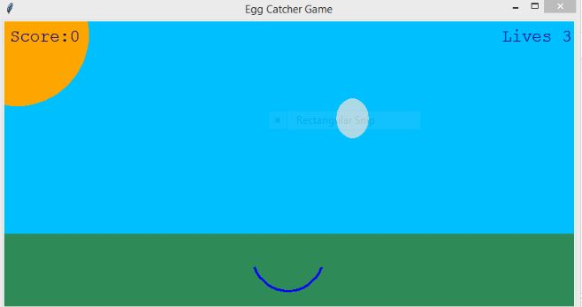

# Egg Catcher Game

This game will test your concentration and the speed of your reflexes. Don't crack under pressure—just catch as many eggs as you can to get a high score. Challenge your friends to see who is the champion egg catcher!

# How to play?
1. Move the catcher along the bottom of the screen to catch each egg before it touches the ground.
2.  When you scoop up an egg you score points, but if you drop an egg you lose a life.
3.   Beware: the more eggs you catch, the more frequently new eggs appear at the top of the screen and the faster they fall. 
4.   Lose all three lives and the game ends. 

## Starting the game with Score = 0 and Lives = 3

## Eggs starts falling from the top 

## Catch the eggs using arrow keys

## Game ends and final score is displayed 

